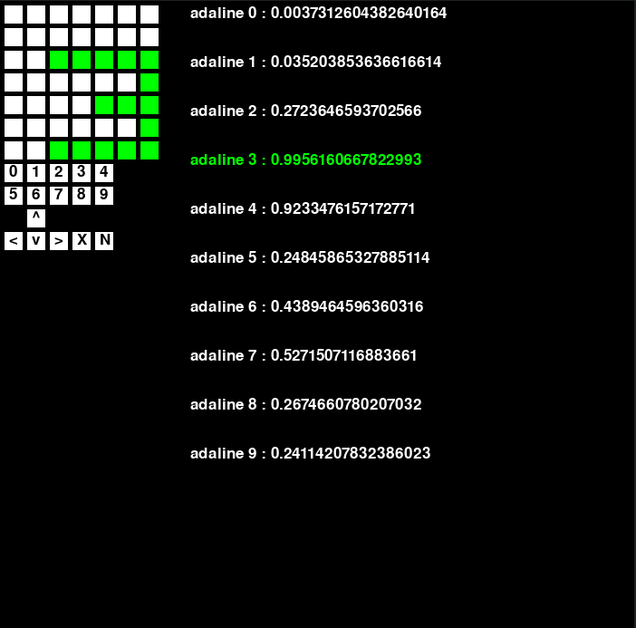

# Adaline - recognizing digits
This project it is about recognizing digits using adline([perceptron](https://en.wikipedia.org/wiki/Perceptron) with [backpropagation](https://en.wikipedia.org/wiki/Backpropagation))
## Requirements
* numpy
* pygame
* matplotlib
## Theory 
In machine learning, the perceptron is an algorithm for supervised learning of binary classifiers. A binary classifier is a function which can decide whether or not an input, represented by a vector of numbers, belongs to some specific class. It is a type of linear classifier, i.e. a classification algorithm that makes its predictions based on a linear predictor function combining a set of weights with the feature vector.
My program recognized 10 digits, so 10 adalines each one is responsible for one digit and give probability (0-1). Simple input for adaline is vector of pixels which is on(1) or off(0), to better learnig result traning data has add little noise. To prevent learning pixels position I add to input vector of fourier_transform.  
## Start 

```python hand_written_digits.py```

## Example
